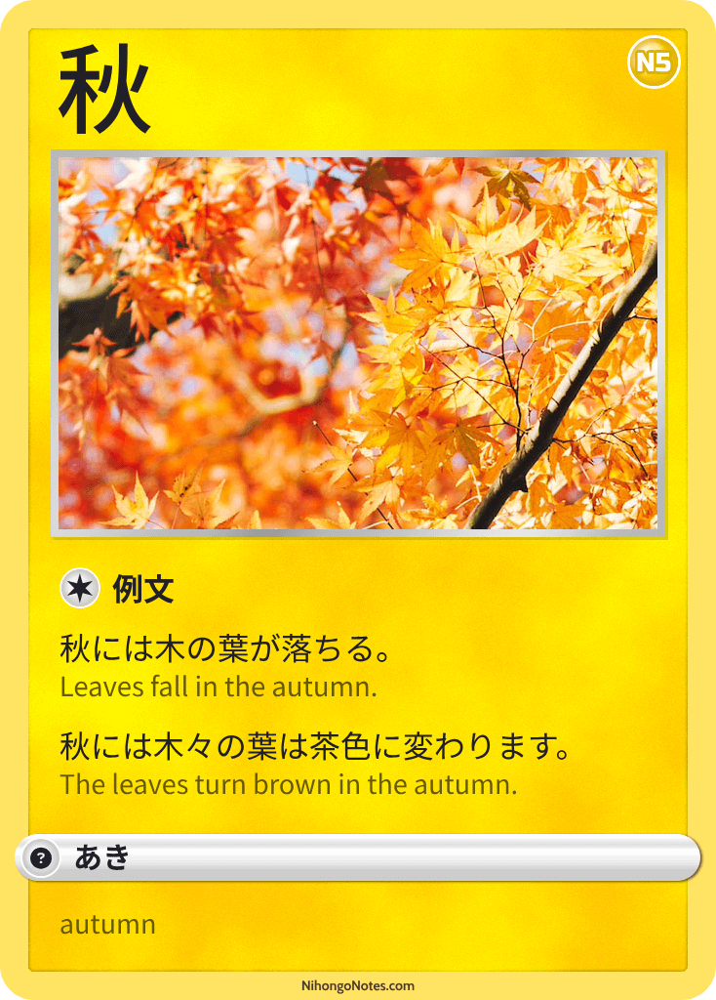

# Japanese Cards

These 'collectable' cards were originally made in a much simpler hiragana version for my kids, but I found the process of making the cards to be a great way of cementing the words and phrases in my mind, so I updated them to kanji and kept making more!

It also adds a bit of extra fun and triggers that collector dopamine effect when putting them in a binder or sticking them on the wall!

I'll trade you two 冬 for a 春 :wink:

## Seasons

#### 春（はる）

#### 夏（なつ）

#### 秋（あき）

#### 冬（ふゆ）

