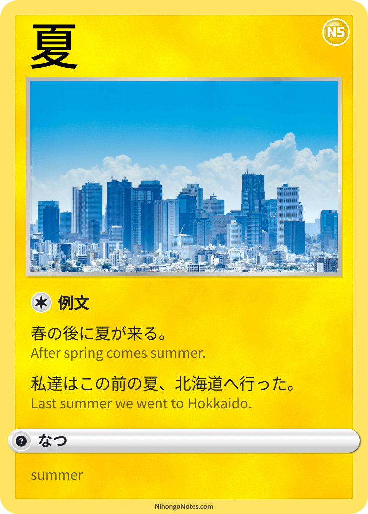

# Japanese Cards

As a way to help myself remember sets of words I'm creating these 'collectable' cards. It adds a bit of extra fun and triggers that dopamine effect when putting them in a binder to flick through later!

I'll trade you two 冬 for a 春 :wink:

## Seasons

#### 春（はる）

#### 夏（なつ）

#### 秋（あき）

#### 冬（ふゆ）

