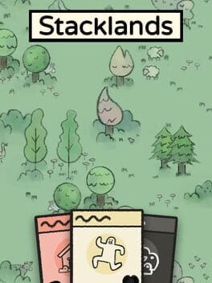
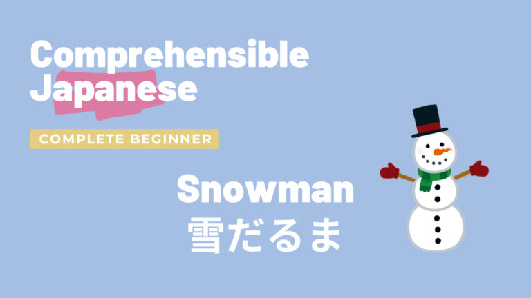

# Immersion

  ALL
  Games
  <!-- TV Shows -->
  YouTube

<!-- ## Up Next -->

<!-- 

  

    

      
    

    

      

      

      

    

  

  

    

      
    

    

      

      

      

    

  

 -->

## September 2023

  

    

      
    

    

      
09 Sep 23

      

      
Playing

    

  

  

    

      
    

    

      
08 Sep 23

      

      
08 Sep 23

    

  

  <!-- 

    

      
    

    

      
06 Sep 23

      

      
On Hold

    

  

  

    

      
    

    

      
06 Sep 23

      

      
<abbr title="The game was getting boring">Abandoned</abbr>

    

  

  

    

      
    

    

      
06 Sep 23

      

      
20 Dec 23

    

  
 -->

