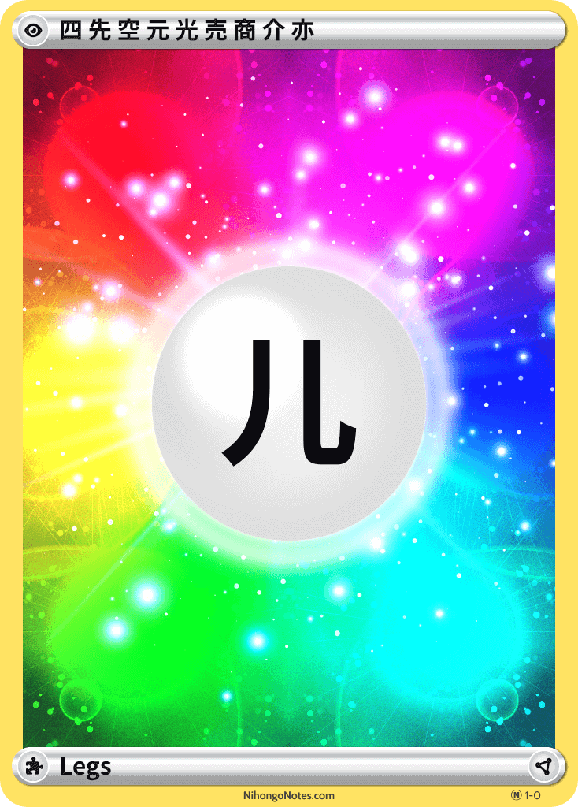
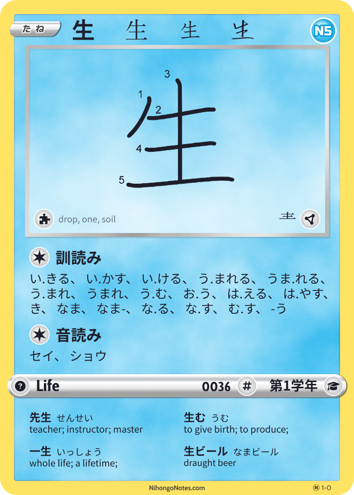
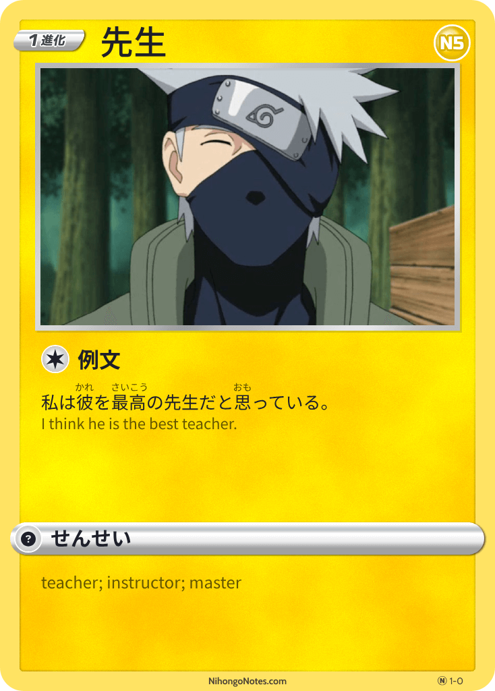

<h1 style="display:none;margin:0;">Nihongo Notes</h1>

Welcome!

Nihongo Notes is a collection of cards and notes related to the Japanese Language Proficiency Test (JLPT) and Japanese language immersion.

    

    
    <h2>JLPT N5</h2>
    <a href="#">Grammar</a> <a href="#">Vocabulary</a> <a href="#">Kanji</a>
    

    
    <h2>JLPT N4</h2>
    
Coming Soon

    

    
    <h2>JLPT N3</h2>
    
Coming Soon

    

    
    <h2>JLPT N2</h2>
    
Coming Soon

    

    
    <h2>JLPT N1</h2>
    
Coming Soon

    

