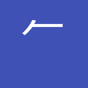
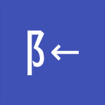

# Particles

95/95 keywords reviewed

100%

### 儿 legs  <small>p001</small>

<strong>Variant</strong>  None

<strong>Particles</strong>  None

<strong>Usage</strong> <a href="https://nihongonotes.com/kanji/grade1/#four-0006">四</a> <a href="https://nihongonotes.com/kanji/grade1/#previous-0134">先</a> <a href="https://nihongonotes.com/kanji/grade1/#sky-0398">空</a> <a href="https://nihongonotes.com/kanji/grade2/#origin-0136">元</a> <a href="https://nihongonotes.com/kanji/grade2/#light-0137">光</a> <a href="https://nihongonotes.com/kanji/grade2/#sell-0353">売</a> <a href="https://nihongonotes.com/kanji/grade3/#merchant-0351">商</a> <a href="https://nihongonotes.com/kanji/grade71/#concern-oneself-0611">介</a> <a href="https://nihongonotes.com/kanji/other/#also-0773">亦</a> 

<small>View on: <a href="https://jisho.org/search/儿%20%23kanji" target="_blank">jisho.org</a> | <a href="https://www.wanikani.com/search?query=儿" target="_blank">wanikani.com</a></small>

### 亠 top hat  <small>p002</small>

<strong>Variant</strong>  None

<strong>Particles</strong>  None

<strong>Usage</strong> <a href="https://nihongonotes.com/kanji/grade1/#six-0008">六</a> <a href="https://nihongonotes.com/kanji/grade2/#mingle-0102">交</a> <a href="https://nihongonotes.com/kanji/grade2/#tall-0185">高</a> <a href="https://nihongonotes.com/kanji/grade2/#capital-0245">京</a> <a href="https://nihongonotes.com/kanji/grade6/#backside-0704">裏</a> <a href="https://nihongonotes.com/kanji/other/#also-0773">亦</a> 

<small>View on: <a href="https://jisho.org/search/亠%20%23kanji" target="_blank">jisho.org</a> | <a href="https://www.wanikani.com/search?query=亠" target="_blank">wanikani.com</a></small>

### ト wand  <small>p003</small>

<strong>Variant</strong>  ⺊

<strong>Particles</strong>  None

<strong>Usage</strong> <a href="https://nihongonotes.com/kanji/grade1/#below-0040">下</a> <a href="https://nihongonotes.com/kanji/grade2/#outside-0266">外</a> <a href="https://nihongonotes.com/kanji/grade71/#fortune-0348">占</a> <a href="https://nihongonotes.com/kanji/grade72/#suspend-1117-unreviewed">掛</a> <a href="https://nihongonotes.com/kanji/particles/#tiger-p083">虍</a> 

<small>View on: <a href="https://jisho.org/search/ト%20%23kanji" target="_blank">jisho.org</a> | <a href="https://www.wanikani.com/search?query=ト" target="_blank">wanikani.com</a></small>

###  gun  <small>p004</small>

<strong>Variant</strong>  None

<strong>Particles</strong>  None

<strong>Usage</strong> <a href="https://nihongonotes.com/kanji/grade1/#year-0117">年</a> <a href="https://nihongonotes.com/kanji/grade1/#stone-0403">石</a> <a href="https://nihongonotes.com/kanji/grade2/#every-0105">毎</a> <a href="https://nihongonotes.com/kanji/grade2/#noon-0115">午</a> <a href="https://nihongonotes.com/kanji/grade3/#tribe-0568-unreviewed">族</a> <a href="https://nihongonotes.com/kanji/grade3/#trip-0569-unreviewed">旅</a> <a href="https://nihongonotes.com/kanji/grade3/#play-0570-unreviewed">遊</a> <a href="https://nihongonotes.com/kanji/particles/#air-p013">气</a> 

<small>Custom image particle, no dictionary lookup available.</small>

### ㇇ gasp  <small>p005</small>

<strong>Variant</strong>  乛𠃌𠃍

<strong>Particles</strong>  None

<strong>Usage</strong> <a href="https://nihongonotes.com/kanji/grade2/#now-0228">今</a> <a href="https://nihongonotes.com/kanji/grade3/#bureau-0256">局</a> <a href="https://nihongonotes.com/kanji/grade4/#become-0070">成</a> <a href="https://nihongonotes.com/kanji/particles/#air-p013">气</a> 

<small>View on: <a href="https://jisho.org/search/㇇%20%23kanji" target="_blank">jisho.org</a> | <a href="https://www.wanikani.com/search?query=㇇" target="_blank">wanikani.com</a></small>

### 丿 slash  <small>p006</small>

<strong>Variant</strong>  乀

<strong>Particles</strong>  None

<strong>Usage</strong> <a href="https://nihongonotes.com/kanji/grade2/#wind-0425">風</a> <a href="https://nihongonotes.com/kanji/grade3/#someone-0107">者</a> <a href="https://nihongonotes.com/kanji/grade4/#inevitable-0549-unreviewed">必</a> <a href="https://nihongonotes.com/kanji/grade6/#childs-respect-0630">孝</a> <a href="https://nihongonotes.com/kanji/grade71/#chinese-spear-0164">矛</a>  <a href="https://nihongonotes.com/kanji/particles/#spear-p071">戈</a> <a href="https://nihongonotes.com/kanji/particles/#double-edged-spear-p072">戊</a> 

<small>View on: <a href="https://jisho.org/search/丿%20%23kanji" target="_blank">jisho.org</a> | <a href="https://www.wanikani.com/search?query=丿" target="_blank">wanikani.com</a></small>

### 丶 drop  <small>p007</small>

<strong>Variant</strong>  None

<strong>Particles</strong>  None

<strong>Usage</strong> <a href="https://nihongonotes.com/kanji/grade1/#hundred-0016">百</a> <a href="https://nihongonotes.com/kanji/grade1/#ball-0073">玉</a> <a href="https://nihongonotes.com/kanji/grade2/#round-0012">丸</a> <a href="https://nihongonotes.com/kanji/grade2/#self-0081">自</a> <a href="https://nihongonotes.com/kanji/grade3/#facing-yonder-0183">向</a> <a href="https://nihongonotes.com/kanji/grade3/#master-0365">主</a> <a href="https://nihongonotes.com/kanji/grade4/#from-0066">以</a> <a href="https://nihongonotes.com/kanji/grade4/#good-0285">良</a> <a href="https://nihongonotes.com/kanji/grade71/#blade-0087">刃</a> <a href="https://nihongonotes.com/kanji/grade71/#rice-bowl-0436">丼</a> <a href="https://nihongonotes.com/kanji/other/#droplet-0168">勺</a> <a href="https://nihongonotes.com/kanji/particles/#house-p031">宀</a> 

<small>View on: <a href="https://jisho.org/search/丶%20%23kanji" target="_blank">jisho.org</a> | <a href="https://www.wanikani.com/search?query=丶" target="_blank">wanikani.com</a></small>

### 乚 hook  <small>p008</small>

<strong>Variant</strong>  乙

<strong>Particles</strong>  None

<strong>Usage</strong> <a href="https://nihongonotes.com/kanji/grade3/#thanks-0313">礼</a> <a href="https://nihongonotes.com/kanji/grade4/#from-0066">以</a> <a href="https://nihongonotes.com/kanji/grade6/#milk-0160">乳</a> <a href="https://nihongonotes.com/kanji/grade6/#riot-0380">乱</a>  

<small>View on: <a href="https://jisho.org/search/乚%20%23kanji" target="_blank">jisho.org</a> | <a href="https://www.wanikani.com/search?query=乚" target="_blank">wanikani.com</a></small>

### 氵 water  <small>p009</small>

<strong>Variant</strong>  None

<strong>Particles</strong>  None

<strong>Usage</strong> <a href="https://nihongonotes.com/kanji/grade2/#lively-0054">活</a> <a href="https://nihongonotes.com/kanji/grade2/#sea-0106">海</a> <a href="https://nihongonotes.com/kanji/grade2/#steam-0127">汽</a> <a href="https://nihongonotes.com/kanji/grade2/#pond-0188">池</a> <a href="https://nihongonotes.com/kanji/grade2/#comfort-0302">楽</a> <a href="https://nihongonotes.com/kanji/grade3/#warm-up-0199">温</a> <a href="https://nihongonotes.com/kanji/grade3/#lake-0259">湖</a> <a href="https://nihongonotes.com/kanji/grade3/#next-0278">次</a> <a href="https://nihongonotes.com/kanji/grade3/#decide-0330">決</a> <a href="https://nihongonotes.com/kanji/grade3/#pour-0368">注</a> <a href="https://nihongonotes.com/kanji/grade3/#oil-0433">油</a> <a href="https://nihongonotes.com/kanji/grade4/#method-0139">法</a> <a href="https://nihongonotes.com/kanji/grade4/#full-0179">満</a> <a href="https://nihongonotes.com/kanji/grade5/#semi-0714-unreviewed">準</a> <a href="https://nihongonotes.com/kanji/grade6/#wash-0135">洗</a> <a href="https://nihongonotes.com/kanji/grade6/#tide-0146">潮</a> <a href="https://nihongonotes.com/kanji/grade6/#spring-water-0207">泉</a> <a href="https://nihongonotes.com/kanji/grade6/#source-0209">源</a> <a href="https://nihongonotes.com/kanji/grade71/#damp-0200">湿</a> <a href="https://nihongonotes.com/kanji/grade71/#ferry-across-0281">渡</a> <a href="https://nihongonotes.com/kanji/grade71/#flood-0358">洪</a> <a href="https://nihongonotes.com/kanji/grade71/#sweat-0410">汗</a> <a href="https://nihongonotes.com/kanji/grade71/#have-relations-with-0680-unreviewed">渉</a> <a href="https://nihongonotes.com/kanji/grade72/#drop-2-1119-unreviewed">滴</a> <a href="https://nihongonotes.com/kanji/grade72/#overnight-1183-unreviewed">泊</a> <a href="https://nihongonotes.com/kanji/grade75/#mud-2117-unreviewed">泥</a> <a href="https://nihongonotes.com/kanji/grade75/#spread-out-2119">氾</a> <a href="https://nihongonotes.com/kanji/other/#eventide-0268">汐</a> <a href="https://nihongonotes.com/kanji/other/#overflow-0415">溢</a> <a href="https://nihongonotes.com/kanji/other/#wet-2112-unreviewed">濡</a> 

<small>View on: <a href="https://jisho.org/search/氵%20%23kanji" target="_blank">jisho.org</a> | <a href="https://www.wanikani.com/search?query=氵" target="_blank">wanikani.com</a></small>

### 冫 ice  <small>p010</small>

<strong>Variant</strong>  None

<strong>Particles</strong>  None

<strong>Usage</strong> <a href="https://nihongonotes.com/kanji/grade2/#diagram-0298">図</a> <a href="https://nihongonotes.com/kanji/grade2/#winter-2-0360">冬</a> <a href="https://nihongonotes.com/kanji/grade2/#weak-0424">弱</a> <a href="https://nihongonotes.com/kanji/grade3/#cold-0361">寒</a> <a href="https://nihongonotes.com/kanji/grade71/#exhaust-0338">尽</a> 

<small>View on: <a href="https://jisho.org/search/冫%20%23kanji" target="_blank">jisho.org</a> | <a href="https://www.wanikani.com/search?query=冫" target="_blank">wanikani.com</a></small>

### 丬 icicle  <small>p011</small>

<strong>Variant</strong>  爿

<strong>Particles</strong>  None

<strong>Usage</strong> <a href="https://nihongonotes.com/kanji/grade5/#form-condition-letter-0616-unreviewed">状</a> 

<small>View on: <a href="https://jisho.org/search/丬%20%23kanji" target="_blank">jisho.org</a> | <a href="https://www.wanikani.com/search?query=丬" target="_blank">wanikani.com</a></small>

### 灬 fire  <small>p012</small>

<strong>Variant</strong>  火

<strong>Particles</strong>  None

<strong>Usage</strong> <a href="https://nihongonotes.com/kanji/grade2/#point-0349">点</a> <a href="https://nihongonotes.com/kanji/grade2/#autumn-0364">秋</a> <a href="https://nihongonotes.com/kanji/grade3/#field-0129">畑</a> 

<small>View on: <a href="https://jisho.org/search/灬%20%23kanji" target="_blank">jisho.org</a> | <a href="https://www.wanikani.com/search?query=灬" target="_blank">wanikani.com</a></small>

### 气 air  <small>p013</small>

<strong>Variant</strong>  None

<strong>Particles</strong>  <a href="https://nihongonotes.com/kanji/particles/#gun-p004">gun</a>, <a href="https://nihongonotes.com/kanji/grade1/#one-0002">one</a>, <a href="https://nihongonotes.com/kanji/particles/#gasp-p005">gasp</a>

<strong>Usage</strong> <a href="https://nihongonotes.com/kanji/grade1/#spirit-0126">気</a> <a href="https://nihongonotes.com/kanji/grade2/#steam-0127">汽</a> 

<small>View on: <a href="https://jisho.org/search/气%20%23kanji" target="_blank">jisho.org</a> | <a href="https://www.wanikani.com/search?query=气" target="_blank">wanikani.com</a></small>

### 囗 enclosure  <small>p014</small>

<strong>Variant</strong>  None

<strong>Particles</strong>  None

<strong>Usage</strong> <a href="https://nihongonotes.com/kanji/grade2/#country-0075">国</a> <a href="https://nihongonotes.com/kanji/grade2/#diagram-0298">図</a> <a href="https://nihongonotes.com/kanji/grade2/#garden-0856">園</a> <a href="https://nihongonotes.com/kanji/grade4/#harden-0260">固</a> <a href="https://nihongonotes.com/kanji/grade4/#surround-0435">囲</a> <a href="https://nihongonotes.com/kanji/grade5/#group-0649">団</a> 

<small>View on: <a href="https://jisho.org/search/囗%20%23kanji" target="_blank">jisho.org</a> | <a href="https://www.wanikani.com/search?query=囗" target="_blank">wanikani.com</a></small>

### メ treasure  <small>p015</small>

<strong>Variant</strong>  None

<strong>Particles</strong>  None

<strong>Usage</strong> <a href="https://nihongonotes.com/kanji/grade1/#spirit-0126">気</a> <a href="https://nihongonotes.com/kanji/grade2/#diagram-0298">図</a> <a href="https://nihongonotes.com/kanji/grade3/#district-0297">区</a> <a href="https://nihongonotes.com/kanji/grade71/#villain-0296">凶</a> 

<small>View on: <a href="https://jisho.org/search/メ%20%23kanji" target="_blank">jisho.org</a> | <a href="https://www.wanikani.com/search?query=メ" target="_blank">wanikani.com</a></small>

### 彳 flash  <small>p016</small>

<strong>Variant</strong>  None

<strong>Particles</strong>  None

<strong>Usage</strong> <a href="https://nihongonotes.com/kanji/grade2/#going-0055">行</a> <a href="https://nihongonotes.com/kanji/grade2/#behind-0114">後</a> <a href="https://nihongonotes.com/kanji/grade3/#wait-0386">待</a> <a href="https://nihongonotes.com/kanji/grade4/#acquire-0387">得</a> 

<small>View on: <a href="https://jisho.org/search/彳%20%23kanji" target="_blank">jisho.org</a> | <a href="https://www.wanikani.com/search?query=彳" target="_blank">wanikani.com</a></small>

### 亍 stepping foot  <small>p017</small>

<strong>Variant</strong>  None

<strong>Particles</strong>  None

<strong>Usage</strong> <a href="https://nihongonotes.com/kanji/grade2/#going-0055">行</a> 

<small>View on: <a href="https://jisho.org/search/亍%20%23kanji" target="_blank">jisho.org</a> | <a href="https://www.wanikani.com/search?query=亍" target="_blank">wanikani.com</a></small>

### 忄 feeling  <small>p018</small>

<strong>Variant</strong>  㣺

<strong>Particles</strong>  None

<strong>Usage</strong> <a href="https://nihongonotes.com/kanji/grade5/#gender-0128">性</a> <a href="https://nihongonotes.com/kanji/grade5/#pleasant-0331">快</a> <a href="https://nihongonotes.com/kanji/grade71/#comprehend-0326">悟</a> 

<small>View on: <a href="https://jisho.org/search/忄%20%23kanji" target="_blank">jisho.org</a> | <a href="https://www.wanikani.com/search?query=忄" target="_blank">wanikani.com</a></small>

### 丨 stick  <small>p019</small>

<strong>Variant</strong>  None

<strong>Particles</strong>  None

<strong>Usage</strong> <a href="https://nihongonotes.com/kanji/grade1/#middle-0035">中</a> <a href="https://nihongonotes.com/kanji/grade2/#pull-0422">引</a> <a href="https://nihongonotes.com/kanji/grade3/#humbly-0315">申</a> <a href="https://nihongonotes.com/kanji/grade4/#servant-0484">臣</a> <a href="https://nihongonotes.com/kanji/grade4/#season-seasonal-weather-1675-unreviewed">候</a> <a href="https://nihongonotes.com/kanji/grade5/#exist-0406">在</a> <a href="https://nihongonotes.com/kanji/grade6/#exist-2-0407">存</a> <a href="https://nihongonotes.com/kanji/grade71/#towel-0203">巾</a> 

<small>View on: <a href="https://jisho.org/search/丨%20%23kanji" target="_blank">jisho.org</a> | <a href="https://www.wanikani.com/search?query=丨" target="_blank">wanikani.com</a></small>

### 凵 box  <small>p020</small>

<strong>Variant</strong>  廿

<strong>Particles</strong>  None

<strong>Usage</strong> <a href="https://nihongonotes.com/kanji/grade2/#picture-0176">画</a> <a href="https://nihongonotes.com/kanji/grade3/#degrees-0280">度</a> <a href="https://nihongonotes.com/kanji/grade4/#seat-0279">席</a> <a href="https://nihongonotes.com/kanji/grade71/#villain-0296">凶</a> 

<small>View on: <a href="https://jisho.org/search/凵%20%23kanji" target="_blank">jisho.org</a> | <a href="https://www.wanikani.com/search?query=凵" target="_blank">wanikani.com</a></small>

### 冂 hood  <small>p021</small>

<strong>Variant</strong>  None

<strong>Particles</strong>  None

<strong>Usage</strong> <a href="https://nihongonotes.com/kanji/grade2/#same-0182">同</a> <a href="https://nihongonotes.com/kanji/grade3/#both-0177">両</a> <a href="https://nihongonotes.com/kanji/grade3/#merchant-0351">商</a> <a href="https://nihongonotes.com/kanji/grade4/#circumference-0304">周</a> <a href="https://nihongonotes.com/kanji/grade71/#towel-0203">巾</a> <a href="https://nihongonotes.com/kanji/other/#hill-2-0178">岡</a> <a href="https://nihongonotes.com/kanji/particles/#mustache-p022">冋</a> 

<small>View on: <a href="https://jisho.org/search/冂%20%23kanji" target="_blank">jisho.org</a> | <a href="https://www.wanikani.com/search?query=冂" target="_blank">wanikani.com</a></small>

### 冋 mustache  <small>p022</small>

<strong>Variant</strong>  None

<strong>Particles</strong>  <a href="https://nihongonotes.com/kanji/particles/#hood-p021">hood</a>, <a href="https://nihongonotes.com/kanji/grade1/#mouth-0019">mouth</a>

<strong>Usage</strong> <a href="https://nihongonotes.com/kanji/grade2/#tall-0185">高</a> <a href="https://nihongonotes.com/kanji/grade3/#facing-yonder-0183">向</a> <a href="https://nihongonotes.com/kanji/grade71/#furthermore-0184">尚</a> 

<small>View on: <a href="https://jisho.org/search/冋%20%23kanji" target="_blank">jisho.org</a> | <a href="https://www.wanikani.com/search?query=冋" target="_blank">wanikani.com</a></small>

### 匚 cage  <small>p023</small>

<strong>Variant</strong>  None

<strong>Particles</strong>  None

<strong>Usage</strong> <a href="https://nihongonotes.com/kanji/grade3/#district-0297">区</a> 

<small>View on: <a href="https://jisho.org/search/匚%20%23kanji" target="_blank">jisho.org</a> | <a href="https://www.wanikani.com/search?query=匚" target="_blank">wanikani.com</a></small>

### 几 table  <small>p024</small>

<strong>Variant</strong>  None

<strong>Particles</strong>  None

<strong>Usage</strong> <a href="https://nihongonotes.com/kanji/grade2/#wind-0425">風</a> <a href="https://nihongonotes.com/kanji/particles/#weapon-p075">殳</a> 

<small>View on: <a href="https://jisho.org/search/几%20%23kanji" target="_blank">jisho.org</a> | <a href="https://www.wanikani.com/search?query=几" target="_blank">wanikani.com</a></small>

### 勹 wrap  <small>p025</small>

<strong>Variant</strong>  ⺈

<strong>Particles</strong>  None

<strong>Usage</strong> <a href="https://nihongonotes.com/kanji/grade2/#color-0528">色</a> <a href="https://nihongonotes.com/kanji/grade3/#number-0300">号</a> <a href="https://nihongonotes.com/kanji/grade5/#paragraph-0166">句</a> <a href="https://nihongonotes.com/kanji/grade5/#uniformity-0394">均</a> <a href="https://nihongonotes.com/kanji/grade71/#in-season-0167">旬</a> <a href="https://nihongonotes.com/kanji/other/#droplet-0168">勺</a> 

<small>View on: <a href="https://jisho.org/search/勹%20%23kanji" target="_blank">jisho.org</a> | <a href="https://www.wanikani.com/search?query=勹" target="_blank">wanikani.com</a></small>

###  seal  <small>p026</small>

<strong>Variant</strong>  卩㔾

<strong>Particles</strong>  None

<strong>Usage</strong> <a href="https://nihongonotes.com/kanji/grade3/#fate-0232">命</a> <a href="https://nihongonotes.com/kanji/grade4/#orders-0229">令</a> <a href="https://nihongonotes.com/kanji/grade4/#seal-2-0231">印</a> <a href="https://nihongonotes.com/kanji/grade71/#instant-0390">即</a> <a href="https://nihongonotes.com/kanji/grade75/#spread-out-2119">氾</a> 

<small>Custom image particle, no dictionary lookup available.</small>

### 厂 cliff  <small>p027</small>

<strong>Variant</strong>  广

<strong>Particles</strong>  None

<strong>Usage</strong> <a href="https://nihongonotes.com/kanji/grade2/#expression-0180">顔</a> <a href="https://nihongonotes.com/kanji/grade2/#original-0208">原</a> <a href="https://nihongonotes.com/kanji/grade2/#wide-0238">広</a> <a href="https://nihongonotes.com/kanji/grade2/#shop-2-0347">店</a> <a href="https://nihongonotes.com/kanji/grade3/#degrees-0280">度</a> <a href="https://nihongonotes.com/kanji/grade3/#anti-0374">反</a> <a href="https://nihongonotes.com/kanji/grade4/#give-birth-0181">産</a> <a href="https://nihongonotes.com/kanji/grade4/#government-office-0247">府</a> <a href="https://nihongonotes.com/kanji/grade4/#seat-0279">席</a> <a href="https://nihongonotes.com/kanji/grade5/#pressure-0186">圧</a> <a href="https://nihongonotes.com/kanji/grade5/#equipprovide-0715-unreviewed">備</a> <a href="https://nihongonotes.com/kanji/grade71/#obsolete-0149">廃</a> <a href="https://nihongonotes.com/kanji/grade71/#corridor-0287">廊</a> <a href="https://nihongonotes.com/kanji/particles/#tiger-p083">虍</a> 

<small>View on: <a href="https://jisho.org/search/厂%20%23kanji" target="_blank">jisho.org</a> | <a href="https://www.wanikani.com/search?query=厂" target="_blank">wanikani.com</a></small>

### 冖 cover  <small>p028</small>

<strong>Variant</strong>  None

<strong>Particles</strong>  None

<strong>Usage</strong> <a href="https://nihongonotes.com/kanji/grade2/#sell-0353">売</a> <a href="https://nihongonotes.com/kanji/grade3/#to-receive-0065">受</a> <a href="https://nihongonotes.com/kanji/grade3/#carry-0584">運</a>  <a href="https://nihongonotes.com/kanji/particles/#house-p031">宀</a> 

<small>View on: <a href="https://jisho.org/search/冖%20%23kanji" target="_blank">jisho.org</a> | <a href="https://www.wanikani.com/search?query=冖" target="_blank">wanikani.com</a></small>

###  schoolhouse  <small>p029</small>

<strong>Variant</strong>  None

<strong>Particles</strong>  <a href="https://nihongonotes.com/kanji/grade1/#small-0034">small</a>, <a href="https://nihongonotes.com/kanji/particles/#cover-p028">cover</a>

<strong>Usage</strong> <a href="https://nihongonotes.com/kanji/grade1/#study-0099">学</a> <a href="https://nihongonotes.com/kanji/grade4/#hall-0320">堂</a> <a href="https://nihongonotes.com/kanji/grade4/#prize-0322">賞</a> <a href="https://nihongonotes.com/kanji/grade4/#memorize-0325">覚</a> <a href="https://nihongonotes.com/kanji/grade5/#normal-0321">常</a> <a href="https://nihongonotes.com/kanji/grade6/#party-0319">党</a> <a href="https://nihongonotes.com/kanji/grade71/#manipulate-0324">掌</a> 

<small>Custom image particle, no dictionary lookup available.</small>

### 𠆢 roof  <small>p030</small>

<strong>Variant</strong>  None

<strong>Particles</strong>  None

<strong>Usage</strong> <a href="https://nihongonotes.com/kanji/grade2/#eat-0288">食</a> <a href="https://nihongonotes.com/kanji/grade2/#tea-0603">茶</a> <a href="https://nihongonotes.com/kanji/grade3/#all-0078">全</a> <a href="https://nihongonotes.com/kanji/grade5/#excess-0995">余</a> <a href="https://nihongonotes.com/kanji/grade71/#concern-oneself-0611">介</a> <a href="https://nihongonotes.com/kanji/particles/#meet-p086">亼</a> 

<small>View on: <a href="https://jisho.org/search/𠆢%20%23kanji" target="_blank">jisho.org</a> | <a href="https://www.wanikani.com/search?query=𠆢" target="_blank">wanikani.com</a></small>

### 宀 house  <small>p031</small>

<strong>Variant</strong>  None

<strong>Particles</strong>  <a href="https://nihongonotes.com/kanji/particles/#drop-p007">drop</a>, <a href="https://nihongonotes.com/kanji/particles/#cover-p028">cover</a>

<strong>Usage</strong> <a href="https://nihongonotes.com/kanji/grade1/#character-0098">字</a> <a href="https://nihongonotes.com/kanji/grade1/#sky-0398">空</a> <a href="https://nihongonotes.com/kanji/grade2/#house-2-0219">家</a> <a href="https://nihongonotes.com/kanji/grade2/#room-0253">室</a> <a href="https://nihongonotes.com/kanji/grade3/#fix-0045">定</a> <a href="https://nihongonotes.com/kanji/grade3/#cheap-0096">安</a> <a href="https://nihongonotes.com/kanji/grade3/#lodge-0292">宿</a> <a href="https://nihongonotes.com/kanji/grade3/#cold-0361">寒</a> <a href="https://nihongonotes.com/kanji/grade4/#government-0290">官</a> <a href="https://nihongonotes.com/kanji/grade4/#harm-0413">害</a> <a href="https://nihongonotes.com/kanji/grade6/#treasure-2-0074">宝</a> <a href="https://nihongonotes.com/kanji/grade6/#hole-0397">穴</a> <a href="https://nihongonotes.com/kanji/grade6/#constitution-0417">憲</a> 

<small>View on: <a href="https://jisho.org/search/宀%20%23kanji" target="_blank">jisho.org</a> | <a href="https://www.wanikani.com/search?query=宀" target="_blank">wanikani.com</a></small>

### 圭 ivy  <small>p032</small>

<strong>Variant</strong>  None

<strong>Particles</strong>  <a href="https://nihongonotes.com/kanji/grade1/#soil-0030">soil</a>

<strong>Usage</strong> <a href="https://nihongonotes.com/kanji/grade72/#suspend-1117-unreviewed">掛</a> 

<small>View on: <a href="https://jisho.org/search/圭%20%23kanji" target="_blank">jisho.org</a> | <a href="https://www.wanikani.com/search?query=圭" target="_blank">wanikani.com</a></small>

###  tremor  <small>p033</small>

<strong>Variant</strong>  None

<strong>Particles</strong>  <a href="https://nihongonotes.com/kanji/grade1/#soil-0030">soil</a>, <a href="https://nihongonotes.com/kanji/grade1/#mouth-0019">mouth</a>

<strong>Usage</strong> <a href="https://nihongonotes.com/kanji/grade4/#circumference-0304">周</a> 

<small>Custom image particle, no dictionary lookup available.</small>

### 厶 nose  <small>p034</small>

<strong>Variant</strong>  None

<strong>Particles</strong>  None

<strong>Usage</strong> <a href="https://nihongonotes.com/kanji/grade2/#public-0089">公</a> <a href="https://nihongonotes.com/kanji/grade2/#wide-0238">広</a> <a href="https://nihongonotes.com/kanji/grade2/#strong-0423">強</a> <a href="https://nihongonotes.com/kanji/grade3/#past-0138">去</a> <a href="https://nihongonotes.com/kanji/grade5/#detain-1170-unreviewed">留</a> <a href="https://nihongonotes.com/kanji/grade6/#watashi-0237">私</a> <a href="https://nihongonotes.com/kanji/grade6/#window-0558">窓</a>  

<small>View on: <a href="https://jisho.org/search/厶%20%23kanji" target="_blank">jisho.org</a> | <a href="https://www.wanikani.com/search?query=厶" target="_blank">wanikani.com</a></small>

###  smushed nose  <small>p035</small>

<strong>Variant</strong>  None

<strong>Particles</strong>  <a href="https://nihongonotes.com/kanji/grade1/#one-0002">one</a>, <a href="https://nihongonotes.com/kanji/particles/#nose-p034">nose</a>

<strong>Usage</strong> <a href="https://nihongonotes.com/kanji/grade2/#meeting-0226">会</a> <a href="https://nihongonotes.com/kanji/grade6/#attain-0250">至</a> 

<small>Custom image particle, no dictionary lookup available.</small>

### マ magic  <small>p036</small>

<strong>Variant</strong>  None

<strong>Particles</strong>  None

<strong>Usage</strong> <a href="https://nihongonotes.com/kanji/grade2/#pass-through-0159">通</a> <a href="https://nihongonotes.com/kanji/grade3/#beforehand-0163">予</a> <a href="https://nihongonotes.com/kanji/grade71/#chinese-spear-0164">矛</a> 

<small>View on: <a href="https://jisho.org/search/マ%20%23kanji" target="_blank">jisho.org</a> | <a href="https://www.wanikani.com/search?query=マ" target="_blank">wanikani.com</a></small>

### 礻 altar  <small>p037</small>

<strong>Variant</strong>  None

<strong>Particles</strong>  None

<strong>Usage</strong> <a href="https://nihongonotes.com/kanji/grade2/#company-0314">社</a> <a href="https://nihongonotes.com/kanji/grade3/#thanks-0313">礼</a> <a href="https://nihongonotes.com/kanji/grade3/#god-0316">神</a> 

<small>View on: <a href="https://jisho.org/search/礻%20%23kanji" target="_blank">jisho.org</a> | <a href="https://www.wanikani.com/search?query=礻" target="_blank">wanikani.com</a></small>

###  ape  <small>p038</small>

<strong>Variant</strong>  袁

<strong>Particles</strong>  <a href="https://nihongonotes.com/kanji/grade1/#soil-0030">soil</a>, <a href="https://nihongonotes.com/kanji/grade1/#mouth-0019">mouth</a>, <a href="https://nihongonotes.com/kanji/grade4/#garment-0700">garment</a>

<strong>Usage</strong> <a href="https://nihongonotes.com/kanji/grade2/#garden-0856">園</a> 

<small>Custom image particle, no dictionary lookup available.</small>

###  by one's side  <small>p039</small>

<strong>Variant</strong>  None

<strong>Particles</strong>  <a href="https://nihongonotes.com/kanji/grade1/#one-0002">one</a>, <a href="https://nihongonotes.com/kanji/particles/#slash-p006">slash</a>

<strong>Usage</strong> <a href="https://nihongonotes.com/kanji/grade1/#left-0401">左</a> <a href="https://nihongonotes.com/kanji/grade1/#right-0402">右</a> <a href="https://nihongonotes.com/kanji/grade2/#friend-0399">友</a> <a href="https://nihongonotes.com/kanji/grade3/#have-0400">有</a> <a href="https://nihongonotes.com/kanji/grade5/#cloth-0204">布</a> <a href="https://nihongonotes.com/kanji/grade5/#exist-0406">在</a> <a href="https://nihongonotes.com/kanji/grade6/#exist-2-0407">存</a> 

<small>Custom image particle, no dictionary lookup available.</small>

### ⻌ road  <small>p040</small>

<strong>Variant</strong>  ⻍

<strong>Particles</strong>  None

<strong>Usage</strong> <a href="https://nihongonotes.com/kanji/grade2/#pass-through-0159">通</a> <a href="https://nihongonotes.com/kanji/grade2/#near-0194">近</a> <a href="https://nihongonotes.com/kanji/grade2/#week-0305">週</a> <a href="https://nihongonotes.com/kanji/grade3/#advance-0191">進</a> <a href="https://nihongonotes.com/kanji/grade3/#return-0378">返</a> <a href="https://nihongonotes.com/kanji/grade3/#play-0570-unreviewed">遊</a> <a href="https://nihongonotes.com/kanji/grade3/#carry-0584">運</a> <a href="https://nihongonotes.com/kanji/grade4/#area-0195">辺</a> <a href="https://nihongonotes.com/kanji/grade4/#take-along-0582-unreviewed">連</a> <a href="https://nihongonotes.com/kanji/grade4/#accomplished-1475-unreviewed">達</a> <a href="https://nihongonotes.com/kanji/grade5/#fit-1121-unreviewed">適</a> <a href="https://nihongonotes.com/kanji/grade71/#crowded-0192">込</a> <a href="https://nihongonotes.com/kanji/grade72/#welcome-1139-unreviewed">迎</a> 

<small>View on: <a href="https://jisho.org/search/⻌%20%23kanji" target="_blank">jisho.org</a> | <a href="https://www.wanikani.com/search?query=⻌" target="_blank">wanikani.com</a></small>

###  eel  <small>p041</small>

<strong>Variant</strong>  None

<strong>Particles</strong>  <a href="https://nihongonotes.com/kanji/grade1/#sun-0001">sun</a>, <a href="https://nihongonotes.com/kanji/particles/#hook-p008">hook</a>

<strong>Usage</strong> <a href="https://nihongonotes.com/kanji/grade2/#electricity-0155">電</a> <a href="https://nihongonotes.com/kanji/grade73/#myself-1356">俺</a> 

<small>Custom image particle, no dictionary lookup available.</small>

### 亲 spice tree  <small>p042</small>

<strong>Variant</strong>  None

<strong>Particles</strong>  <a href="https://nihongonotes.com/kanji/grade1/#stand-0067">stand</a>, <a href="https://nihongonotes.com/kanji/grade1/#tree-0028">tree</a>

<strong>Usage</strong> <a href="https://nihongonotes.com/kanji/grade2/#new-0275">新</a> <a href="https://nihongonotes.com/kanji/grade2/#parent-0276">親</a> 

<small>View on: <a href="https://jisho.org/search/亲%20%23kanji" target="_blank">jisho.org</a> | <a href="https://www.wanikani.com/search?query=亲" target="_blank">wanikani.com</a></small>

### 聿 brush  <small>p043</small>

<strong>Variant</strong>  ⺻

<strong>Particles</strong>  None

<strong>Usage</strong> <a href="https://nihongonotes.com/kanji/grade2/#write-0079">書</a> 

<small>View on: <a href="https://jisho.org/search/聿%20%23kanji" target="_blank">jisho.org</a> | <a href="https://www.wanikani.com/search?query=聿" target="_blank">wanikani.com</a></small>

### ヨ broom  <small>p044</small>

<strong>Variant</strong>  彐⺕

<strong>Particles</strong>  None

<strong>Usage</strong> <a href="https://nihongonotes.com/kanji/grade2/#day-of-the-week-0025">曜</a> <a href="https://nihongonotes.com/kanji/grade2/#hit-0141">当</a> <a href="https://nihongonotes.com/kanji/grade2/#snow-0899">雪</a> <a href="https://nihongonotes.com/kanji/grade2/#homecoming-1018-unreviewed">帰</a> <a href="https://nihongonotes.com/kanji/grade3/#thing-0080">事</a> <a href="https://nihongonotes.com/kanji/grade3/#green-0607">緑</a> 

<small>View on: <a href="https://jisho.org/search/ヨ%20%23kanji" target="_blank">jisho.org</a> | <a href="https://www.wanikani.com/search?query=ヨ" target="_blank">wanikani.com</a></small>

### 攵 chair shot  <small>p045</small>

<blockquote class="story">
Think WWE folding chair shot
</blockquote>

<strong>Variant</strong>  攴

<strong>Particles</strong>  None

<strong>Usage</strong> <a href="https://nihongonotes.com/kanji/grade2/#count-0309">数</a> <a href="https://nihongonotes.com/kanji/grade2/#teach-0632-unreviewed">教</a> <a href="https://nihongonotes.com/kanji/grade3/#arrange-0308">整</a> <a href="https://nihongonotes.com/kanji/grade4/#renew-0429">改</a> <a href="https://nihongonotes.com/kanji/grade5/#politics-0246">政</a> <a href="https://nihongonotes.com/kanji/grade5/#circumstance-0257">故</a> <a href="https://nihongonotes.com/kanji/grade5/#enemy-1122-unreviewed">敵</a> <a href="https://nihongonotes.com/kanji/grade71/#do-0251">致</a> 

<small>View on: <a href="https://jisho.org/search/攵%20%23kanji" target="_blank">jisho.org</a> | <a href="https://www.wanikani.com/search?query=攵" target="_blank">wanikani.com</a></small>

### 艹 flowers  <small>p046</small>

<strong>Variant</strong>  None

<strong>Particles</strong>  None

<strong>Usage</strong> <a href="https://nihongonotes.com/kanji/grade1/#flower-0121">花</a> <a href="https://nihongonotes.com/kanji/grade1/#grass-0144">草</a> <a href="https://nihongonotes.com/kanji/grade2/#tea-0603">茶</a> <a href="https://nihongonotes.com/kanji/grade3/#medicine-0303">薬</a> <a href="https://nihongonotes.com/kanji/grade3/#suffering-0405">苦</a> <a href="https://nihongonotes.com/kanji/grade3/#leaf-0605-unreviewed">葉</a> <a href="https://nihongonotes.com/kanji/grade4/#full-0179">満</a> <a href="https://nihongonotes.com/kanji/grade4/#art-0225">芸</a> <a href="https://nihongonotes.com/kanji/grade4/#england-0332">英</a> <a href="https://nihongonotes.com/kanji/grade4/#vegetable-0988-unreviewed">菜</a> <a href="https://nihongonotes.com/kanji/grade5/#equipprovide-0715-unreviewed">備</a> <a href="https://nihongonotes.com/kanji/grade6/#young-0404">若</a> <a href="https://nihongonotes.com/kanji/grade71/#confectionery-0602">菓</a> <a href="https://nihongonotes.com/kanji/grade74/#draw-1824">描</a> 

<small>View on: <a href="https://jisho.org/search/艹%20%23kanji" target="_blank">jisho.org</a> | <a href="https://www.wanikani.com/search?query=艹" target="_blank">wanikani.com</a></small>

### 䒑 horns  <small>p047</small>

<strong>Variant</strong>  丷

<strong>Particles</strong>  None

<strong>Usage</strong> <a href="https://nihongonotes.com/kanji/grade2/#front-0113">前</a> <a href="https://nihongonotes.com/kanji/grade2/#rice-0234">米</a> <a href="https://nihongonotes.com/kanji/grade3/#peace-0334">平</a> <a href="https://nihongonotes.com/kanji/grade4/#connect-with-0451">関</a> <a href="https://nihongonotes.com/kanji/grade5/#benefit-0414">益</a> <a href="https://nihongonotes.com/kanji/grade6/#line-up-0333">並</a> <a href="https://nihongonotes.com/kanji/grade75/#narrow-1933">狭</a> <a href="https://nihongonotes.com/kanji/other/#hill-2-0178">岡</a> 

<small>View on: <a href="https://jisho.org/search/䒑%20%23kanji" target="_blank">jisho.org</a> | <a href="https://www.wanikani.com/search?query=䒑" target="_blank">wanikani.com</a></small>

### 匕 spoon  <small>p048</small>

<strong>Variant</strong>  None

<strong>Particles</strong>  None

<strong>Usage</strong> <a href="https://nihongonotes.com/kanji/grade3/#change-0120">化</a> <a href="https://nihongonotes.com/kanji/grade3/#death-0716">死</a> <a href="https://nihongonotes.com/kanji/grade3/#finger-0932-unreviewed">指</a> <a href="https://nihongonotes.com/kanji/grade5/#compare-0123">比</a> <a href="https://nihongonotes.com/kanji/grade5/#compare-0123">比</a> <a href="https://nihongonotes.com/kanji/grade75/#mud-2117-unreviewed">泥</a> 

<small>View on: <a href="https://jisho.org/search/匕%20%23kanji" target="_blank">jisho.org</a> | <a href="https://www.wanikani.com/search?query=匕" target="_blank">wanikani.com</a></small>

### 犭 animal  <small>p049</small>

<strong>Variant</strong>  None

<strong>Particles</strong>  None

<strong>Usage</strong> <a href="https://nihongonotes.com/kanji/grade5/#alone-0346">独</a> <a href="https://nihongonotes.com/kanji/grade74/#monkey-1859">猿</a> <a href="https://nihongonotes.com/kanji/grade75/#narrow-1933">狭</a> <a href="https://nihongonotes.com/kanji/other/#wild-boar-0217">猪</a> 

<small>View on: <a href="https://jisho.org/search/犭%20%23kanji" target="_blank">jisho.org</a> | <a href="https://www.wanikani.com/search?query=犭" target="_blank">wanikani.com</a></small>

### 豕 pig  <small>p050</small>

<strong>Variant</strong>  None

<strong>Particles</strong>  None

<strong>Usage</strong> <a href="https://nihongonotes.com/kanji/grade2/#house-2-0219">家</a> <a href="https://nihongonotes.com/kanji/grade71/#pig-2-0218">豚</a> 

<small>View on: <a href="https://jisho.org/search/豕%20%23kanji" target="_blank">jisho.org</a> | <a href="https://www.wanikani.com/search?query=豕" target="_blank">wanikani.com</a></small>

### 也 alligator  <small>p051</small>

<strong>Variant</strong>  None

<strong>Particles</strong>  None

<strong>Usage</strong> <a href="https://nihongonotes.com/kanji/grade2/#ground-0187">地</a> <a href="https://nihongonotes.com/kanji/grade2/#pond-0188">池</a> <a href="https://nihongonotes.com/kanji/grade3/#other-0189">他</a> 

<small>View on: <a href="https://jisho.org/search/也%20%23kanji" target="_blank">jisho.org</a> | <a href="https://www.wanikani.com/search?query=也" target="_blank">wanikani.com</a></small>

### 㠯 bear  <small>p052</small>

<strong>Variant</strong>  None

<strong>Particles</strong>  None

<strong>Usage</strong> <a href="https://nihongonotes.com/kanji/grade4/#government-0290">官</a> 

<small>View on: <a href="https://jisho.org/search/㠯%20%23kanji" target="_blank">jisho.org</a> | <a href="https://www.wanikani.com/search?query=㠯" target="_blank">wanikani.com</a></small>

### 彡 hair  <small>p053</small>

<strong>Variant</strong>  None

<strong>Particles</strong>  None

<strong>Usage</strong> <a href="https://nihongonotes.com/kanji/grade2/#shape-0147">形</a> <a href="https://nihongonotes.com/kanji/grade2/#expression-0180">顔</a> 

<small>View on: <a href="https://jisho.org/search/彡%20%23kanji" target="_blank">jisho.org</a> | <a href="https://www.wanikani.com/search?query=彡" target="_blank">wanikani.com</a></small>

###  apron  <small>p054</small>

<strong>Variant</strong>  None

<strong>Particles</strong>  None

<strong>Usage</strong> <a href="https://nihongonotes.com/kanji/grade2/#homecoming-1018-unreviewed">帰</a> 

<small>Custom image particle, no dictionary lookup available.</small>

### 艮 root  <small>p055</small>

<strong>Variant</strong>  郎

<strong>Particles</strong>  <a href="https://nihongonotes.com/kanji/grade1/#sun-0001">sun</a>, <a href="https://nihongonotes.com/kanji/particles/#skirt-p056">skirt</a>

<strong>Usage</strong> <a href="https://nihongonotes.com/kanji/grade2/#eat-0288">食</a> <a href="https://nihongonotes.com/kanji/grade3/#silver-0283">銀</a> <a href="https://nihongonotes.com/kanji/grade3/#root-2-0284">根</a> <a href="https://nihongonotes.com/kanji/grade4/#good-0285">良</a> <a href="https://nihongonotes.com/kanji/grade5/#limit-0282">限</a> <a href="https://nihongonotes.com/kanji/grade5/#eyeball-1092-unreviewed">眼</a> <a href="https://nihongonotes.com/kanji/grade71/#guy-0286">郎</a> <a href="https://nihongonotes.com/kanji/grade71/#instant-0390">即</a> 

<small>View on: <a href="https://jisho.org/search/艮%20%23kanji" target="_blank">jisho.org</a> | <a href="https://www.wanikani.com/search?query=艮" target="_blank">wanikani.com</a></small>

### 𧘇 skirt  <small>p056</small>

<strong>Variant</strong>  None

<strong>Particles</strong>  None

<strong>Usage</strong> <a href="https://nihongonotes.com/kanji/grade3/#trip-0569-unreviewed">旅</a> <a href="https://nihongonotes.com/kanji/grade3/#express-0705">表</a> <a href="https://nihongonotes.com/kanji/grade6/#backside-0704">裏</a> <a href="https://nihongonotes.com/kanji/particles/#root-p055">艮</a> 

<small>View on: <a href="https://jisho.org/search/𧘇%20%23kanji" target="_blank">jisho.org</a> | <a href="https://www.wanikani.com/search?query=𧘇" target="_blank">wanikani.com</a></small>

### 扌 fingers  <small>p057</small>

<strong>Variant</strong>  None

<strong>Particles</strong>  None

<strong>Usage</strong> <a href="https://nihongonotes.com/kanji/grade3/#hold-0384">持</a> <a href="https://nihongonotes.com/kanji/grade3/#finger-0932-unreviewed">指</a> <a href="https://nihongonotes.com/kanji/grade4/#fold-1698">折</a> <a href="https://nihongonotes.com/kanji/grade6/#ego-0221">我</a> <a href="https://nihongonotes.com/kanji/grade72/#suspend-1117-unreviewed">掛</a> <a href="https://nihongonotes.com/kanji/grade72/#pick-1118-unreviewed">摘</a> <a href="https://nihongonotes.com/kanji/grade74/#draw-1824">描</a> 

<small>View on: <a href="https://jisho.org/search/扌%20%23kanji" target="_blank">jisho.org</a> | <a href="https://www.wanikani.com/search?query=扌" target="_blank">wanikani.com</a></small>

### 卬 cat pirate  <small>p058</small>

<strong>Variant</strong>  None

<strong>Particles</strong>  None

<strong>Usage</strong> <a href="https://nihongonotes.com/kanji/grade72/#welcome-1139-unreviewed">迎</a> 

<small>View on: <a href="https://jisho.org/search/卬%20%23kanji" target="_blank">jisho.org</a> | <a href="https://www.wanikani.com/search?query=卬" target="_blank">wanikani.com</a></small>

### 隹 turkey  <small>p059</small>

<strong>Variant</strong>  None

<strong>Particles</strong>  None

<strong>Usage</strong> <a href="https://nihongonotes.com/kanji/grade2/#day-of-the-week-0025">曜</a> <a href="https://nihongonotes.com/kanji/grade3/#gather-0190">集</a> <a href="https://nihongonotes.com/kanji/grade3/#advance-0191">進</a> <a href="https://nihongonotes.com/kanji/grade5/#miscellaneous-0379">雑</a> <a href="https://nihongonotes.com/kanji/grade5/#semi-0714-unreviewed">準</a> <a href="https://nihongonotes.com/kanji/grade74/#hold-a-meeting-1653">催</a> 

<small>View on: <a href="https://jisho.org/search/隹%20%23kanji" target="_blank">jisho.org</a> | <a href="https://www.wanikani.com/search?query=隹" target="_blank">wanikani.com</a></small>

### 罒 net  <small>p060</small>

<strong>Variant</strong>  None

<strong>Particles</strong>  None

<strong>Usage</strong> <a href="https://nihongonotes.com/kanji/grade2/#buy-0352">買</a> <a href="https://nihongonotes.com/kanji/grade6/#constitution-0417">憲</a> 

<small>View on: <a href="https://jisho.org/search/罒%20%23kanji" target="_blank">jisho.org</a> | <a href="https://www.wanikani.com/search?query=罒" target="_blank">wanikani.com</a></small>

### 歹 remains  <small>p061</small>

<strong>Variant</strong>  None

<strong>Particles</strong>  None

<strong>Usage</strong> <a href="https://nihongonotes.com/kanji/grade3/#death-0716">死</a> <a href="https://nihongonotes.com/kanji/grade3/#row-0718">列</a> 

<small>View on: <a href="https://jisho.org/search/歹%20%23kanji" target="_blank">jisho.org</a> | <a href="https://www.wanikani.com/search?query=歹" target="_blank">wanikani.com</a></small>

### 夂 winter  <small>p062</small>

<strong>Variant</strong>  None

<strong>Particles</strong>  None

<strong>Usage</strong> <a href="https://nihongonotes.com/kanji/grade2/#behind-0114">後</a> <a href="https://nihongonotes.com/kanji/grade2/#wheat-0131">麦</a> <a href="https://nihongonotes.com/kanji/grade2/#winter-2-0360">冬</a> <a href="https://nihongonotes.com/kanji/grade2/#summer-0363">夏</a> <a href="https://nihongonotes.com/kanji/grade5/#article-in-document-0119">条</a> <a href="https://nihongonotes.com/kanji/grade6/#descend-1377">降</a> 

<small>View on: <a href="https://jisho.org/search/夂%20%23kanji" target="_blank">jisho.org</a> | <a href="https://www.wanikani.com/search?query=夂" target="_blank">wanikani.com</a></small>

### 幺 spiderman  <small>p063</small>

<strong>Variant</strong>  None

<strong>Particles</strong>  None

<strong>Usage</strong> <a href="https://nihongonotes.com/kanji/grade1/#thread-0112">糸</a> <a href="https://nihongonotes.com/kanji/grade2/#behind-0114">後</a> 

<small>View on: <a href="https://jisho.org/search/幺%20%23kanji" target="_blank">jisho.org</a> | <a href="https://www.wanikani.com/search?query=幺" target="_blank">wanikani.com</a></small>

### 尸 butt  <small>p064</small>

<strong>Variant</strong>  None

<strong>Particles</strong>  None

<strong>Usage</strong> <a href="https://nihongonotes.com/kanji/grade3/#shop-0252">屋</a> <a href="https://nihongonotes.com/kanji/grade3/#bureau-0256">局</a> <a href="https://nihongonotes.com/kanji/grade5/#reside-0255">居</a> <a href="https://nihongonotes.com/kanji/grade75/#mud-2117-unreviewed">泥</a> 

<small>View on: <a href="https://jisho.org/search/尸%20%23kanji" target="_blank">jisho.org</a> | <a href="https://www.wanikani.com/search?query=尸" target="_blank">wanikani.com</a></small>

### 廾 two hands  <small>p065</small>

<strong>Variant</strong>  开龷

<strong>Particles</strong>  None

<strong>Usage</strong> <a href="https://nihongonotes.com/kanji/grade2/#shape-0147">形</a> <a href="https://nihongonotes.com/kanji/grade2/#yellow-0915">黄</a> <a href="https://nihongonotes.com/kanji/grade3/#emit-0148">発</a> <a href="https://nihongonotes.com/kanji/grade3/#once-upon-a-time-0359">昔</a> <a href="https://nihongonotes.com/kanji/grade3/#open-0450">開</a> <a href="https://nihongonotes.com/kanji/grade3/#nose-2-1558">鼻</a> <a href="https://nihongonotes.com/kanji/grade4/#together-0356">共</a> 

<small>View on: <a href="https://jisho.org/search/廾%20%23kanji" target="_blank">jisho.org</a> | <a href="https://www.wanikani.com/search?query=廾" target="_blank">wanikani.com</a></small>

### 廴 yoga  <small>p066</small>

<strong>Variant</strong>  None

<strong>Particles</strong>  None

<small>View on: <a href="https://jisho.org/search/廴%20%23kanji" target="_blank">jisho.org</a> | <a href="https://www.wanikani.com/search?query=廴" target="_blank">wanikani.com</a></small>

###  wall  <small>p067</small>

<strong>Variant</strong>  None

<strong>Particles</strong>  None

<strong>Usage</strong> <a href="https://nihongonotes.com/kanji/grade5/#defend-against-0174">防</a> <a href="https://nihongonotes.com/kanji/grade5/#limit-0282">限</a> <a href="https://nihongonotes.com/kanji/grade6/#descend-1377">降</a> <a href="https://nihongonotes.com/kanji/other/#osaka-0376">阪</a> 

<small>Custom image particle, no dictionary lookup available.</small>

###  hometown  <small>p068</small>

<strong>Variant</strong>  None

<strong>Particles</strong>  None

<strong>Usage</strong> <a href="https://nihongonotes.com/kanji/grade3/#section-0068">部</a> <a href="https://nihongonotes.com/kanji/grade3/#metropolis-0244">都</a> <a href="https://nihongonotes.com/kanji/grade71/#guy-0286">郎</a> 

<small>Custom image particle, no dictionary lookup available.</small>

### 咅 hellmouth  <small>p069</small>

<strong>Variant</strong>  None

<strong>Particles</strong>  <a href="https://nihongonotes.com/kanji/grade1/#stand-0067">stand</a>, <a href="https://nihongonotes.com/kanji/grade1/#mouth-0019">mouth</a>

<strong>Usage</strong> <a href="https://nihongonotes.com/kanji/grade3/#section-0068">部</a> <a href="https://nihongonotes.com/kanji/grade3/#double-0069">倍</a> 

<small>View on: <a href="https://jisho.org/search/咅%20%23kanji" target="_blank">jisho.org</a> | <a href="https://www.wanikani.com/search?query=咅" target="_blank">wanikani.com</a></small>

### 弋 ceremony  <small>p070</small>

<strong>Variant</strong>  None

<strong>Particles</strong>  None

<strong>Usage</strong> <a href="https://nihongonotes.com/kanji/grade3/#substitute-0071">代</a> <a href="https://nihongonotes.com/kanji/grade3/#ritual-0109">式</a> <a href="https://nihongonotes.com/kanji/grade5/#military-0111">武</a> <a href="https://nihongonotes.com/kanji/grade71/#two-2-0110">弐</a> <a href="https://nihongonotes.com/kanji/particles/#spear-p071">戈</a> 

<small>View on: <a href="https://jisho.org/search/弋%20%23kanji" target="_blank">jisho.org</a> | <a href="https://www.wanikani.com/search?query=弋" target="_blank">wanikani.com</a></small>

### 戈 spear  <small>p071</small>

<strong>Variant</strong>  None

<strong>Particles</strong>  <a href="https://nihongonotes.com/kanji/particles/#ceremony-p070">ceremony</a>, <a href="https://nihongonotes.com/kanji/particles/#slash-p006">slash</a>

<strong>Usage</strong> <a href="https://nihongonotes.com/kanji/grade6/#ego-0221">我</a> <a href="https://nihongonotes.com/kanji/particles/#double-edged-spear-p072">戊</a> 

<small>View on: <a href="https://jisho.org/search/戈%20%23kanji" target="_blank">jisho.org</a> | <a href="https://www.wanikani.com/search?query=戈" target="_blank">wanikani.com</a></small>

### 戊 double-edged spear  <small>p072</small>

<strong>Variant</strong>  None

<strong>Particles</strong>  <a href="https://nihongonotes.com/kanji/particles/#spear-p071">spear</a>, <a href="https://nihongonotes.com/kanji/particles/#slash-p006">slash</a>

<strong>Usage</strong> <a href="https://nihongonotes.com/kanji/grade3/#emotion-0327">感</a> <a href="https://nihongonotes.com/kanji/grade4/#become-0070">成</a> 

<small>View on: <a href="https://jisho.org/search/戊%20%23kanji" target="_blank">jisho.org</a> | <a href="https://www.wanikani.com/search?query=戊" target="_blank">wanikani.com</a></small>

### 乍 key  <small>p073</small>

<strong>Variant</strong>  None

<strong>Particles</strong>  None

<strong>Usage</strong> <a href="https://nihongonotes.com/kanji/grade2/#make-0152">作</a> <a href="https://nihongonotes.com/kanji/grade4/#yesterday-0153">昨</a> 

<small>View on: <a href="https://jisho.org/search/乍%20%23kanji" target="_blank">jisho.org</a> | <a href="https://www.wanikani.com/search?query=乍" target="_blank">wanikani.com</a></small>

### 毌 mother  <small>p074</small>

<strong>Variant</strong>  毋母

<strong>Particles</strong>  None

<strong>Usage</strong> <a href="https://nihongonotes.com/kanji/grade2/#every-0105">毎</a> <a href="https://nihongonotes.com/kanji/grade4/#poison-0133">毒</a> 

<small>View on: <a href="https://jisho.org/search/毌%20%23kanji" target="_blank">jisho.org</a> | <a href="https://www.wanikani.com/search?query=毌" target="_blank">wanikani.com</a></small>

### 殳 weapon  <small>p075</small>

<strong>Variant</strong>  None

<strong>Particles</strong>  <a href="https://nihongonotes.com/kanji/particles/#table-p024">table</a>, <a href="https://nihongonotes.com/kanji/grade71/#grabbing-hand-0058">grabbing hand</a>

<small>View on: <a href="https://jisho.org/search/殳%20%23kanji" target="_blank">jisho.org</a> | <a href="https://www.wanikani.com/search?query=殳" target="_blank">wanikani.com</a></small>

### 疋 bolt of cloth  <small>p076</small>

<strong>Variant</strong>  ⺪

<strong>Particles</strong>  None

<small>View on: <a href="https://jisho.org/search/疋%20%23kanji" target="_blank">jisho.org</a> | <a href="https://www.wanikani.com/search?query=疋" target="_blank">wanikani.com</a></small>

### 疒 sick  <small>p077</small>

<strong>Variant</strong>  None

<strong>Particles</strong>  None

<small>View on: <a href="https://jisho.org/search/疒%20%23kanji" target="_blank">jisho.org</a> | <a href="https://www.wanikani.com/search?query=疒" target="_blank">wanikani.com</a></small>

### 癶 tent  <small>p078</small>

<strong>Variant</strong>  None

<strong>Particles</strong>  None

<strong>Usage</strong> <a href="https://nihongonotes.com/kanji/grade3/#emit-0148">発</a> 

<small>View on: <a href="https://jisho.org/search/癶%20%23kanji" target="_blank">jisho.org</a> | <a href="https://www.wanikani.com/search?query=癶" target="_blank">wanikani.com</a></small>

### 禾 grain  <small>p079</small>

<strong>Variant</strong>  None

<strong>Particles</strong>  None

<strong>Usage</strong> <a href="https://nihongonotes.com/kanji/grade2/#autumn-0364">秋</a> <a href="https://nihongonotes.com/kanji/grade3/#harmony-0236">和</a> <a href="https://nihongonotes.com/kanji/grade3/#committee-0396">委</a> <a href="https://nihongonotes.com/kanji/grade4/#seasons-0395">季</a> <a href="https://nihongonotes.com/kanji/grade4/#profit-0412">利</a> <a href="https://nihongonotes.com/kanji/grade6/#watashi-0237">私</a> 

<small>View on: <a href="https://jisho.org/search/禾%20%23kanji" target="_blank">jisho.org</a> | <a href="https://www.wanikani.com/search?query=禾" target="_blank">wanikani.com</a></small>

### 而 rake  <small>p080</small>

<strong>Variant</strong>  None

<strong>Particles</strong>  None

<strong>Usage</strong> <a href="https://nihongonotes.com/kanji/other/#wet-2112-unreviewed">濡</a> 

<small>View on: <a href="https://jisho.org/search/而%20%23kanji" target="_blank">jisho.org</a> | <a href="https://www.wanikani.com/search?query=而" target="_blank">wanikani.com</a></small>

### ⺮ bamboo  <small>p081</small>

<strong>Variant</strong>  竹

<strong>Particles</strong>  None

<strong>Usage</strong> <a href="https://nihongonotes.com/kanji/grade1/#bamboo-2-0243">竹</a> <a href="https://nihongonotes.com/kanji/grade2/#answer-0981-unreviewed">答</a> <a href="https://nihongonotes.com/kanji/grade3/#equal-0393">等</a> <a href="https://nihongonotes.com/kanji/grade4/#season-0391">節</a> <a href="https://nihongonotes.com/kanji/grade4/#laugh-0579">笑</a> <a href="https://nihongonotes.com/kanji/grade6/#muscle-0392">筋</a> <a href="https://nihongonotes.com/kanji/grade71/#counter-for-items-0261">箇</a> <a href="https://nihongonotes.com/kanji/other/#pole-0411">竿</a> 

<small>View on: <a href="https://jisho.org/search/⺮%20%23kanji" target="_blank">jisho.org</a> | <a href="https://www.wanikani.com/search?query=⺮" target="_blank">wanikani.com</a></small>

###  spikes  <small>p082</small>

<strong>Variant</strong>  业

<strong>Particles</strong>  None

<strong>Usage</strong> <a href="https://nihongonotes.com/kanji/grade3/#work-business-industry-0498-unreviewed">業</a> <a href="https://nihongonotes.com/kanji/grade6/#line-up-0333">並</a> <a href="https://nihongonotes.com/kanji/grade71/#damp-0200">湿</a> 

<small>Custom image particle, no dictionary lookup available.</small>

### 虍 tiger  <small>p083</small>

<strong>Variant</strong>  虎

<strong>Particles</strong>  <a href="https://nihongonotes.com/kanji/particles/#wand-p003">wand</a>, <a href="https://nihongonotes.com/kanji/particles/#cliff-p027">cliff</a>, <a href="https://nihongonotes.com/kanji/grade1/#seven-0009">seven</a>

<small>View on: <a href="https://jisho.org/search/虍%20%23kanji" target="_blank">jisho.org</a> | <a href="https://www.wanikani.com/search?query=虍" target="_blank">wanikani.com</a></small>

### 覀 helicopter  <small>p084</small>

<strong>Variant</strong>  襾西

<strong>Particles</strong>  None

<strong>Usage</strong> <a href="https://nihongonotes.com/kanji/grade2/#west-0795-unreviewed">西</a> 

<small>View on: <a href="https://jisho.org/search/覀%20%23kanji" target="_blank">jisho.org</a> | <a href="https://www.wanikani.com/search?query=覀" target="_blank">wanikani.com</a></small>

### 啇 old wizard  <small>p085</small>

<strong>Variant</strong>  None

<strong>Particles</strong>  None

<strong>Usage</strong> <a href="https://nihongonotes.com/kanji/grade5/#fit-1121-unreviewed">適</a> <a href="https://nihongonotes.com/kanji/grade5/#enemy-1122-unreviewed">敵</a> <a href="https://nihongonotes.com/kanji/grade72/#pick-1118-unreviewed">摘</a> <a href="https://nihongonotes.com/kanji/grade72/#drop-2-1119-unreviewed">滴</a> <a href="https://nihongonotes.com/kanji/grade72/#legitimate-wifechild-1120-unreviewed">嫡</a> 

<small>View on: <a href="https://jisho.org/search/啇%20%23kanji" target="_blank">jisho.org</a> | <a href="https://www.wanikani.com/search?query=啇" target="_blank">wanikani.com</a></small>

### 亼 meet  <small>p086</small>

<strong>Variant</strong>  None

<strong>Particles</strong>  <a href="https://nihongonotes.com/kanji/particles/#roof-p030">roof</a>, <a href="https://nihongonotes.com/kanji/grade1/#one-0002">one</a>

<strong>Usage</strong> <a href="https://nihongonotes.com/kanji/grade2/#meeting-0226">会</a> <a href="https://nihongonotes.com/kanji/grade2/#suit-0227">合</a> <a href="https://nihongonotes.com/kanji/grade2/#now-0228">今</a> <a href="https://nihongonotes.com/kanji/grade3/#fate-0232">命</a> <a href="https://nihongonotes.com/kanji/grade4/#orders-0229">令</a> <a href="https://nihongonotes.com/kanji/grade4/#wheel-0944-unreviewed">輪</a> 

<small>View on: <a href="https://jisho.org/search/亼%20%23kanji" target="_blank">jisho.org</a> | <a href="https://www.wanikani.com/search?query=亼" target="_blank">wanikani.com</a></small>

###  comb  <small>p087</small>

<strong>Variant</strong>  𦥑

<strong>Particles</strong>  None

<strong>Usage</strong> <a href="https://nihongonotes.com/kanji/grade4/#seal-2-0231">印</a> 

<small>Custom image particle, no dictionary lookup available.</small>

### ユ yu  <small>p088</small>

<strong>Variant</strong>  None

<strong>Particles</strong>  None

<strong>Usage</strong> <a href="https://nihongonotes.com/kanji/grade4/#season-seasonal-weather-1675-unreviewed">候</a> 

<small>View on: <a href="https://jisho.org/search/ユ%20%23kanji" target="_blank">jisho.org</a> | <a href="https://www.wanikani.com/search?query=ユ" target="_blank">wanikani.com</a></small>

### 𡗗 spring  <small>p089</small>

<strong>Variant</strong>  None

<strong>Particles</strong>  None

<strong>Usage</strong> <a href="https://nihongonotes.com/kanji/grade2/#spring-2-0362">春</a> 

<small>View on: <a href="https://jisho.org/search/𡗗%20%23kanji" target="_blank">jisho.org</a> | <a href="https://www.wanikani.com/search?query=𡗗" target="_blank">wanikani.com</a></small>

### 寸 glue  <small>p090</small>

<strong>Variant</strong>  None

<strong>Particles</strong>  None

<strong>Usage</strong> <a href="https://nihongonotes.com/kanji/grade1/#village-0651">村</a> <a href="https://nihongonotes.com/kanji/grade2/#buddhist-temple-0382">寺</a> <a href="https://nihongonotes.com/kanji/grade4/#attach-0064">付</a> <a href="https://nihongonotes.com/kanji/grade4/#acquire-0387">得</a> <a href="https://nihongonotes.com/kanji/grade5/#group-0649">団</a> <a href="https://nihongonotes.com/kanji/grade6/#measurement-0381">寸②</a> 

<small>View on: <a href="https://jisho.org/search/寸%20%23kanji" target="_blank">jisho.org</a> | <a href="https://www.wanikani.com/search?query=寸" target="_blank">wanikani.com</a></small>

### ハ little feet  <small>p091</small>

<strong>Variant</strong>  None

<strong>Particles</strong>  None

<strong>Usage</strong> <a href="https://nihongonotes.com/kanji/grade1/#six-0008">六</a> <a href="https://nihongonotes.com/kanji/grade1/#eight-0010">八</a> <a href="https://nihongonotes.com/kanji/grade1/#shellfish-0082">貝</a> <a href="https://nihongonotes.com/kanji/grade2/#part-0088">分</a> <a href="https://nihongonotes.com/kanji/grade2/#public-0089">公</a> <a href="https://nihongonotes.com/kanji/grade2/#yellow-0915">黄</a> <a href="https://nihongonotes.com/kanji/grade3/#cold-0361">寒</a> <a href="https://nihongonotes.com/kanji/grade3/#work-business-industry-0498-unreviewed">業</a> <a href="https://nihongonotes.com/kanji/grade3/#tool-0837">具</a> <a href="https://nihongonotes.com/kanji/grade4/#together-0356">共</a> <a href="https://nihongonotes.com/kanji/grade5/#benefit-0414">益</a> <a href="https://nihongonotes.com/kanji/grade6/#hole-0397">穴</a> <a href="https://nihongonotes.com/kanji/other/#overflow-0415">溢</a> <a href="https://nihongonotes.com/kanji/other/#also-0773">亦</a> 

<small>View on: <a href="https://jisho.org/search/ハ%20%23kanji" target="_blank">jisho.org</a> | <a href="https://www.wanikani.com/search?query=ハ" target="_blank">wanikani.com</a></small>

### 𠀎 tall fence  <small>p092</small>

<strong>Variant</strong>  None

<strong>Particles</strong>  None

<strong>Usage</strong> <a href="https://nihongonotes.com/kanji/grade3/#cold-0361">寒</a> 

<small>View on: <a href="https://jisho.org/search/𠀎%20%23kanji" target="_blank">jisho.org</a> | <a href="https://www.wanikani.com/search?query=𠀎" target="_blank">wanikani.com</a></small>

### 夭 early death  <small>p093</small>

<strong>Variant</strong>  None

<strong>Particles</strong>  None

<strong>Usage</strong> <a href="https://nihongonotes.com/kanji/grade4/#laugh-0579">笑</a> 

<small>View on: <a href="https://jisho.org/search/夭%20%23kanji" target="_blank">jisho.org</a> | <a href="https://www.wanikani.com/search?query=夭" target="_blank">wanikani.com</a></small>

### 氺 splash  <small>p094</small>

<strong>Variant</strong>  None

<strong>Particles</strong>  None

<strong>Usage</strong> <a href="https://nihongonotes.com/kanji/grade3/#green-0607">緑</a> 

<small>View on: <a href="https://jisho.org/search/氺%20%23kanji" target="_blank">jisho.org</a> | <a href="https://www.wanikani.com/search?query=氺" target="_blank">wanikani.com</a></small>

### 㐄 almost a year  <small>p095</small>

<strong>Variant</strong>  None

<strong>Particles</strong>  None

<strong>Usage</strong> <a href="https://nihongonotes.com/kanji/grade1/#year-0117">年</a> <a href="https://nihongonotes.com/kanji/grade6/#descend-1377">降</a> 

<small>View on: <a href="https://jisho.org/search/㐄%20%23kanji" target="_blank">jisho.org</a> | <a href="https://www.wanikani.com/search?query=㐄" target="_blank">wanikani.com</a></small>

