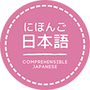
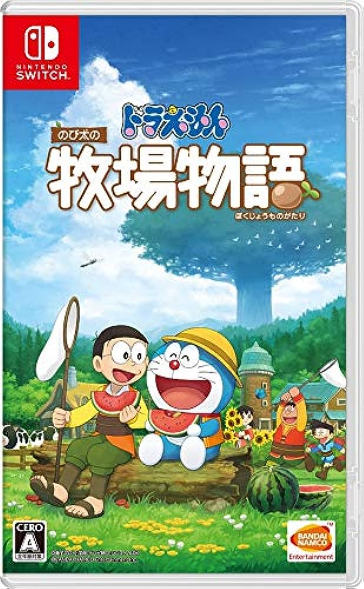
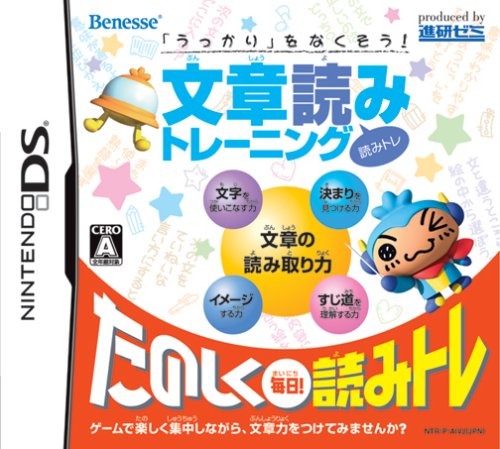

# Path

Welcome to my personal path to learning Japanese, where I summarise the steps I've taken along the way to (hopefully!) Japanese fluency.

## 2023

### August

After many years of on and off study I've decided to get serious about learning Japanese.

It's been years since I last properly studied. I've forgotten so much, but I never really got past JLPT N5 grammar each time before burning out with RTK, Anki and textbooks :material-sleep:

I have no idea how many kanji or vocab I still know, but it's probably no more than 100 of each, and my grammar knowledge is very basic.

The one benefit I have is that I've heard a lot of spoken Japanese over the years so I'm comfortable listening to it and picking out words even if I don't understand much.
I'm also familiar enough with kanji particles that they're no longer random jumbles of lines and I feel like I'll find it easier to remember them this time.

With all that in mind, and after a small trial run, I've decided to go fully into immersion and get massive amounts of comprehensible input.

Starting this month I aim to watch all of the <a href="https://cijapanese.com/" target="_blank">Comprehensible Japanese</a> videos and read all the transcripts up through intermediate level.

At the time of writing that's 456 videos and, at about 8m per video, that's roughly 61 hours of comprehensible input, not including time for reading.

I'm also trying out a few games to see what I can get out of them at this stage. I know there'll be a lot I don't understand but it's all part of keeping it fun and interesting.

I chose ドラえもん のび太の牧場物語 because it has furigana and I enjoy the farming theme. It lacks fully voiced dialogue but I found a <a href="https://www.youtube.com/watch?v=Ez8fz2rq36Y&list=PL-O4RqFKLrZTvpDdYfJJynk8HPgVBzoij&index=1" target="_blank">YouTube playlist with subtitles</a> where the youtuber reads aloud most of the text.

After reviewing various tools for immersion learning and not wanting to mess around with multiple tools, I settled on <a href="https://migaku.com/" target="_blank">Migaku</a>.

My criteria in order of importance were:

* Keep track of known/unknown/ignored words
* Show percentage of words known within a page/transcript before reading it
* Highlight unknown words in text/subtitles
* Highlight i+1 sentences 
* Create visual/audio flashcards

The extension and other tools are all being <a href="https://www.reddit.com/r/ImmerseWithMigaku/comments/11wa1yf/srs_reskin_update_march_2023/" target="_blank">reworked and rebranded</a> and it's breaking away from Anki, so it looks like I can rely on this staying around for a while and improving over time. 

I'll be using this with all content I consume, especially the Comprehensible Japanese videos, so that I can track the vocabulary I know.
I may also use the SRS for important words or words I keep forgetting, but I'm defintely not falling into the trap of SRSing everything like last time!
